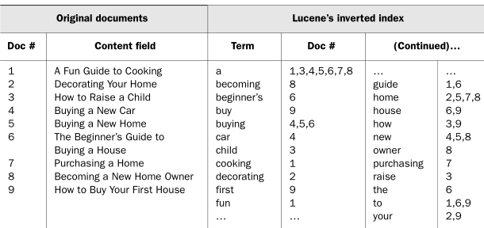

## Elastic Search
루씬 (Lucene) 기반 오픈소스 검색엔진

 

#### Elastic Search & RDMBS 비교
| Elastic Search | DBMS      |
| -------------- | --------- |
| Index          | DB        |
| Type           | Table     |
| Document       | Row       |
| Field          | Column    |
| Mapping        | Schema    |
| Shard          | Partition |
| Query DSL      | SQL       |

 

#### 역색인 (Inverted Index)

키워드 (Term) 에 문서들의 Primary Key (혹은 주소, 파일명 등) 와 같은 값등을 매핑하여 저장하는 기술.

이 기술 덕분에 검색이 매우 빠른 속도로 작동한다.

 

#### 장단점

장점

(1) 오픈소스 검색엔진으로 끊임없이 개선되고 발전하고 있다.

(2) 전문 (Full-Text) 검색이 빠르다.

> 내용 전체를 색인해서 특정 단어가 포함된 문서를 검색할 수 있다.

(3) 통계 분석이 가능하다.

> 비정형 로그 데이터를 수집하여 통계 분석에 활용할 수 있다.

(4) Schemaless

> 정형화되지 않은 문서도 자동으로 색인하고 검색할 수 있다.

(5) RESTful API

> HTTP기반의 RESTful을 활용하고 요청 / 응답에 JSON을 사용하기 때문에 개발 언어, 운영체제, 시스템에 관계없이 다양한 플랫폼에서 활용이 가능하다.

(6) Multi-tenancy

> 서로 상이한 인덱스일지라도 검색할 필드명만 같으면 여러 인덱스를 한번에 조회할 수 있다.

(7) Document-Oriented

> 여러 계층 구조의 문서로 저장이 가능하며, 계층 구조로된 문서도 한번의 쿼리로 쉽게 조회할 수 있다.

(8) 확장성

> 분산 구성이 가능하며, 분산 환경에서 데이터는 shard라는 단위로 나뉜다.

(9) 역색인

> 역색인 

 

단점

(1) 완전 실시간은 아니다.

> 색인된 데이터는 내부적으로 복잡한 과정을 거치기 때문에 1초 뒤에나 검색이 가능하다.

(2) Transaction Rollback을 지원하지 않는다.

> 전체적인 클러스터의 성능 향상을 위해 비용소모가 큰 Rollback과 Transaction을 지원하지 않는다.

(3) 데이터의 업데이트를 제공하지 않는다.

> 업데이트 명령이 올 경우, 기존 문서를 삭제하고 새로운 문서를 생성한다.  
> 업데이트에 비해서 많은 비용이 들지만 이를 통해 불변성 (Immutable) 이라는 이점을 취한다.