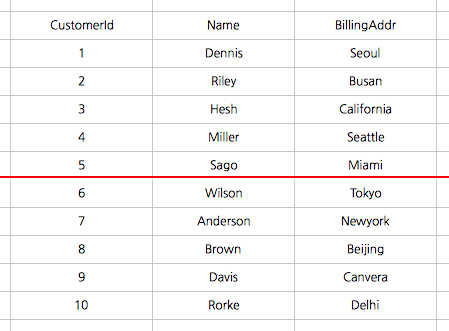
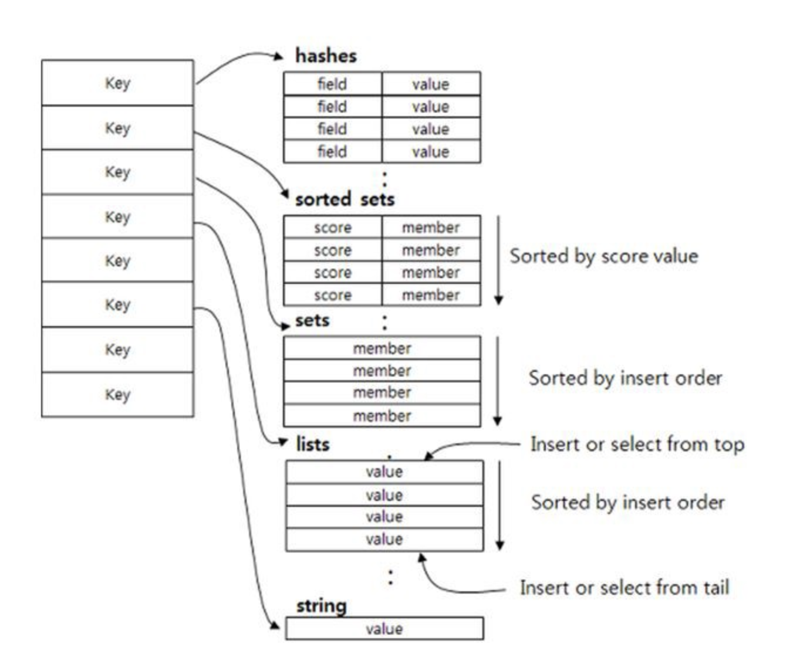

## Redis (REmote Dictionary Storage)

싱글스레드로 동작하는 Key-Value 형태의 비관계형 (NoSQL) DB이다.

 
 

#### 특징
(1) 영속성을 지원하는 인메모리 데이터 저장소이다.

(2) 여러 대의 서버로 구성할 수 있다. (마스터 - 슬레이브)

(3) 쓰기 성능을 높이기 위해 클라이언트측 샤딩을 지원한다.

> 샤딩 (Sharding)
>
> 수평 파티셔닝 (Horizontal Partitioning) 과 동일하며, 동일한 테이블 스키마를 가진 데이터를 다수의 DB에 분산하여 저장하는 방법
>
> 

 

(4) 다양한 데이터 자료형 (String, List, Hash, Set, Sorted Set) 을 지원한다.

 
 

#### Spring에서 자주 사용하는 경우

(1) 서버 세션 (Session) 으로 사용하여 관리

(2) 캐싱 (Caching)

 
 

#### Redis와 Memcached 비교

|     차이    | Memcached | Redis       |
|    :---:   |           |             |
| 데이터 저장   | 메모리      | 메모리, 디스크 (데이터 복구가 가능) |
| 메모리 재사용  | LRU 알고리즘을 통해 데이터가 만료되지 않아도 메모리를 관리한다. | 메모리를 재사용하지 않으며, 명시적으로만 데이터를 삭제할 수 있다. |
| 데이터 타입   | String      | String, Set, List, Hash, Sorted Set |
| 처리 속도     | 디스크를 거치지 않고 메모리에만 저장되기 때문에 속도가 빠르다. | 디스크와 메모리 모두에 데이터가 저장되지만 Memcached와 속도 차이 없이 빠르다. |
| 쓰레드 개수   | 멀티 스레드 지원 | 싱글 스레드 기반 |