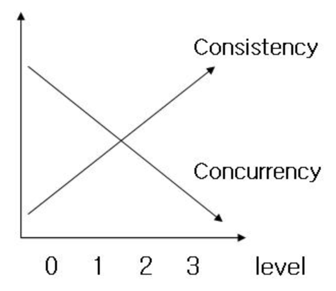

## 트랜잭션 격리 수준 (Transaction Isolation Level)
트랜잭션에서 일관성 없는 데이터를 허용하는 수준  
다시 말해, 동시에 여러 트랜잭션이 처리될 때, 트랜잭션끼리 얼마나 서로 고립되어 있는지를 나타내는 것

 

#### 필요성
DB는 ACID 특징 처럼 트랜잭션이 독립적으로 수행 한다.  
따라서, Lock을 통해 트랜잭션이 DB를 다루는 동안 다른 트랜잭션이 관여하지 못하도록 막는 것이 필요하다.

하지만, 동시에 수행되는 수많은 트랜잭션을 항상 Locking을 통해 순서대로 처리하는 방식으로 구현한다면 DB 성능이 떨어질 것이다.  
그렇다고 해서, 성능을 높이기 위해 Locking의 범위를 줄인다면 잘못된 값이 처리되는 문제가 발생할 수 있다.

따라서 최대한 효율적인 Locking 방법이 필요하다.

 

##### 고려사항
동시성을 증가시키면 데이터 무결성에 문제가 발생하고, 데이터 무결성을 유지하면 동시성이 떨어진다.  
격리 수준을 증가시킬수록 발생하는 비용은 증가한다.

 
 

#### 종류
1. Read Uncommitted (레벨 0)  

어떤 트랜잭션의 변경 내용이 Commit & Rollback과 상관없이 다른 트랜잭션에서 보여진다.

 

다음과 같은 현상이 발생할 수 있다.
> Dirty Read  
> Non-Repeatable Read  
> Phantom Read

 

2. Read Committed (레벨 1)

어떤 트랜잭션의 변경 내용이 Commit 되어야만 다른 트랜잭션에서 조회할 수 있다.
> Oracle, SQL Server DBMS에서 기본으로 사용하고 있고, 온라인 서비스에서 가장 많이 선택되는 격리수준이다.

 

다음과 같은 현상이 발생할 수 있다.
> Non-Repeatable Read  
> Phantom Read

 

3. Repeatable Read (레벨 2)

트랜잭션이 시작되기 전에 Commit된 내용에 대해서만 조회할 수 있다.

즉, 트랜잭션 영역에 해당하는 데이터를 수정할 수 없다.
> MySQL DBMS에서 기본으로 사용하고 있다.

 

다음과 같은 현상이 발생할 수 있다.
> Phantom Read

 

4. Serializable (레벨 3)

가장 단순하고 가장 엄격한 격리수준으로, 읽기 작업에도 Shared Lock이 설정되기 때문에 그동안 다른 트랜잭션이 이 레코드를 변경하지 못한다.

즉, 트랜잭션 영역에 해당하는 데이터를 수정 및 입력할 수 없다.
> 완벽한 읽기 일관성 모드를 제공한다.

 
 

#### 발생하는 현상
Dirty Read (= Uncommitted Dependency)
> 한 트랜잭션에서 수정 중이지만 아직 Commit 되지 않은 데이터를 다른 트랜잭션에서 읽을 수 있도록 허용할 때 발생하는 현상

 

Non-Repeatable Read (= Inconsistent Analysis)
> 한 트랜잭션에서 동일한 쿼리를 두 번 수행할 때, 그 사이에 다른 트랜잭션이 값을 수정 또는 삭제하면서 두 쿼리의 결과가 상이하게 나타나는 비일관성이 발생하는 현상

 

Phantom Read
> 한 트랜잭션 안에서 일정 범위의 레코드를 두 번 이상 읽었을 때, 첫번째 쿼리에서 없던 레코드가 두번째 쿼리에서 나타나는 현상
>
> 트랜잭션 도중 새로운 레코드 삽입을 허용하기 때문에 발생한다.