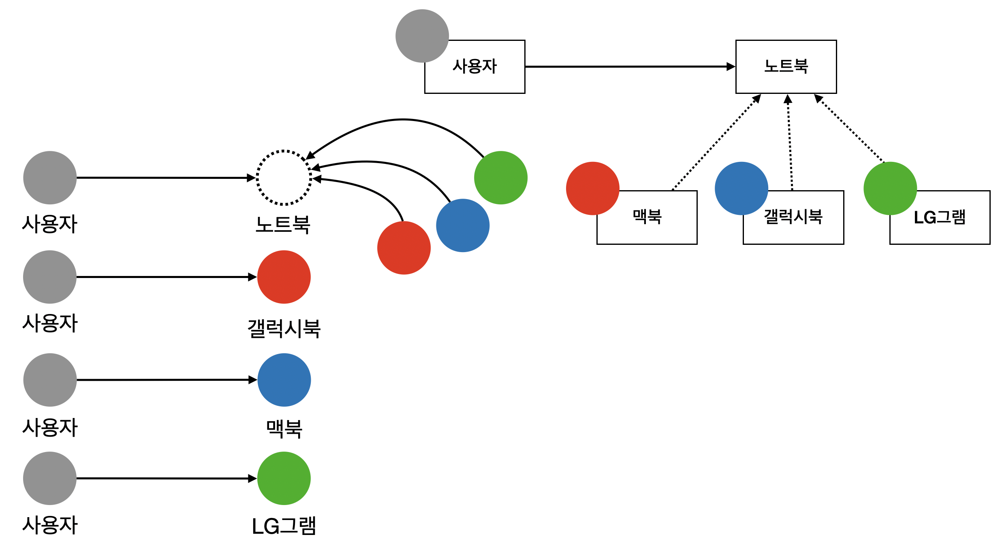

## SOLID

#### 1. S : 단일 책임 원칙 (SRP, Single Responsibility Principle)
S/W 설계 부품 (클래스, 메소드) 은 하나의 책임 (기능) 만을 가져야 한다.

> 변경이 있을 때 파급 효과가 적으면 이 원칙을 잘 따른 것이며,  
> 응집도는 높고 결합도는 낮도록 설계하는 것.

 
 

#### 2. O : 개방-폐쇄 원칙 (OCP, Open-Closed Principle)
기존의 코드를 변경하지 않고 (Closed), 기능을 수정하거나 추가 (Open) 할 수 있도록 설계해야 한다.

> 다형성을 생각해보자.  
> 인터페이스를 구현한 새로운 클래스를 하나 만들어서 새로운 기능을 구현.

 
 

#### 3. L : 리스코프 치환 원칙 (LSP, Liskov Substitution Principle)
자식 클래스는 부모 클래스에서 가능한 행위를 수행할 수 있어야 한다.  
다시 말하면, 부모 클래스 인스턴스 대신 자식 클래스 인스턴스를 사용해도 문제가 없어야 한다.

> 상속 관계에서는 IS-A 관계가 성립해야 하며, 이는 일관성이 있다는 것이다.  
>
> ex) 도형 클래스 - 사각형 클래스 (도형 클래스를 상속)  
> 1) 도형은 둘레를 가지고 있다.  
> 2) 도형은 넓이를 가지고 있다.  
> 3) 도형은 각을 가지고 있다.
> 
> 1) 사각형은 둘레를 가지고 있다.  
> 2) 사각형은 넓이를 가지고 있다.  
> 3) 사각형은 각을 가지고 있다.  
> 이상한 부분은 보이지 않으며, 따라서 도형과 사각형 사이에는 일관성이 있다고 얘기할 수 있다.
>
> 하지만, 여기서 원 클래스가 등장했다고 하자. (도형 클래스를 상속)  
> 1) 원은 둘레를 가지고 있다.  
> 2) 원은 넓이를 가지고 있다.  
> 3) 원은 각을 가지고 있다. (?)  
> 3번으로 인해 도형 클래스는 LSP를 만족하지 않은 설계라고 할 수 있으며, 3번의 일반화 관계를 만족시키도록 다시 설계가 되어야 한다.

 
 

#### 4. I : 인터페이스 분리 원칙 (ISP, Interface Segregation Principle)
하나의 범용적 인터페이스보다는 여러 개의 구체적 인터페이스가 낫다.
다시 말하면, 자신이 사용하지 않는 기능 (인터페이스) 에는 영향을 받지 않아야 한다.

> ex) 핸드폰을 이용하여 전화, 문자, 인터넷 등의 다양한 기능을 사용할 수 있다.  
> 그런데, 전화 기능을 사용할 때에는 인터넷, 사진촬영 등 다른 기능을 사용할 필요가 없다.  
> 따라서 각 기능들을 독립된 인터페이스로 구현하여 서로에게 영향을 미치지 않도록 설계해야 한다.
>
> 이 원칙을 통해 내부 의존성을 약화시켜 리팩토링, 수정, 배포를 쉽게 할 수 있다.

 
 

#### 5. D : 의존관계 역전 원칙 (DIP, Dependency Inversion Principle)
의존 관계를 맺을 때, 변화하기 쉬운 것 (구체적인 것) 보다는 변화하기 어려운 것 (추상적인 것) 에 의존해야 한다.

> DIP를 만족한다는 것은 구체적인 클래스보다 인터페이스나 추상 클래스와 관계를 맺는다는 것을 의미한다.

