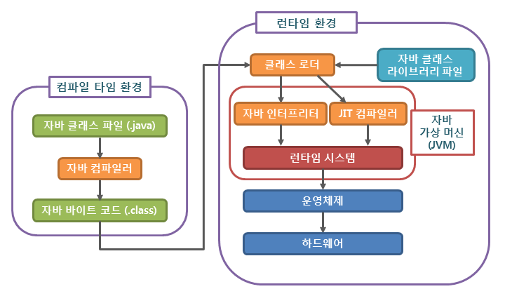

## 자바의 컴파일 과정

#### 컴파일 순서

1. 프로그램이 실행되면 JVM은 OS로부터 프로그램이 필요로 하는 메모리를 할당받는다.

> JVM은 용도에 따라 메모리를 여러 영역으로 나눠 관리한다.

 

2. 자바 컴파일러 (javac, Java Compiler) 가 소스코드 (.java) 를 읽어들여 바이트 코드 (.class) 로 변환시킨다.

> 자바 바이트 코드 (.class) 파일은 아직 컴퓨터는 읽을 수 없고, JVM이 이해할 수 있는 코드이다.
> 바이트 코드의 각 명령어는 1바이트 크기의 Opcode (Operation Code) 와 추가 피연산자로 이루어져 있다.

 

3. 컴파일된 바이트 코드를 JVM의 클래스 로더 (Class Loader) 에게 전달한다.

[클래스 로더 세부 내용](../Java/클래스로더(ClassLoader).md)

 

4. JVM 내에 로드된 바이트 코드는 실행 엔진 (Execution Engine) 을 통해 기계어로 해석된다.

> 이때, 실행 엔진은 두 가지 방식으로 변경한다.

> (1) 인터프리터 (Interpreter)
>
> 바이트 코드 명령어를 하나씩 읽어서 해석하고 실행한다.
> 하나하나의 실행은 빠르나, 전체적인 실행 속도가 느리다.

> (2) JIT 컴파일러 (Just-In-Time Compiler)
> 
> 인터프리터의 단점을 보완하기 위해 도입된 방식으로 바이트 코드 전체를 컴파일하여 바이너리 코드로 변경하고 이후에는 해당 메소드를 더이상 인터프리팅 하지 않고, 바이너리 코드로 직접 실행하는 방식이다.
>
> 하나씩 인터프리팅하여 실행하는 것이 아니라 바이트 코드 전체가 컴파일된 바이너리 코드를 실행하는 것이기 때문에 전체적인 실행속도는 인터프리팅 방식보다 빠르다.

> 요약
>
> 인터프리터 : 바이트 코드를 한 줄씩 실행. 전체 성능면에선 불리.  
>
> JIT 컴파일러 : 전체 바이트 코드를 컴파일하고 캐시에 보관해놓고 직접 실행. 한 번만 실행해도 되는 코드에 대해서는 Interpreter가 유리.

 

5. 해석된 바이트 코드는 런타임 데이터 영역 (Runtime Data Area) 에 배치되어 실질적인 수행이 이루어 진다.

> 이러한 실행 과정 속에서 JVM은 필요에 따라 쓰레드 동기화나 GC 같은 메모리 관리 작업을 수행한다.

#### Reference
https://steady-snail.tistory.com/67
