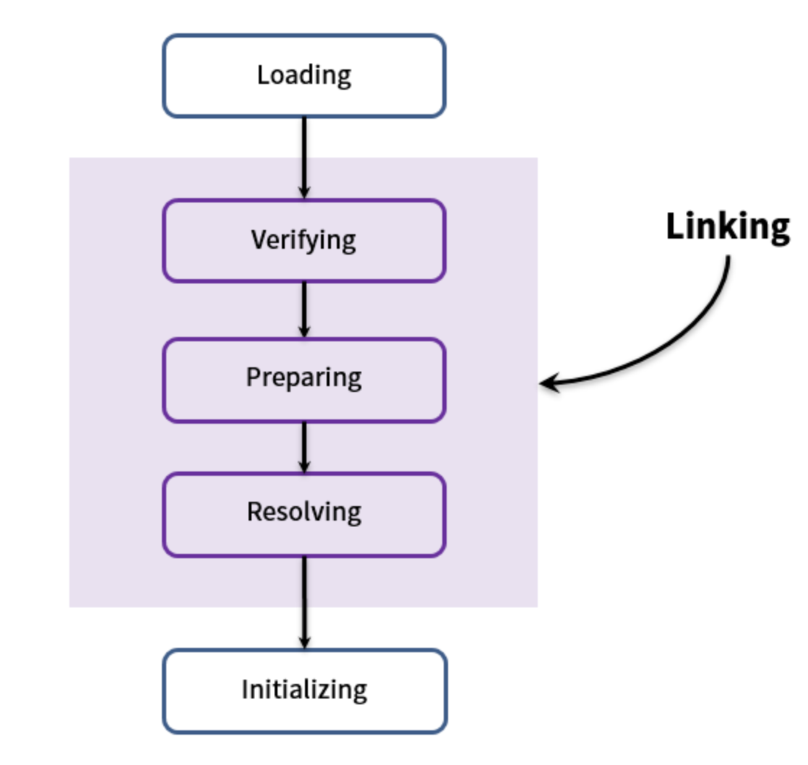
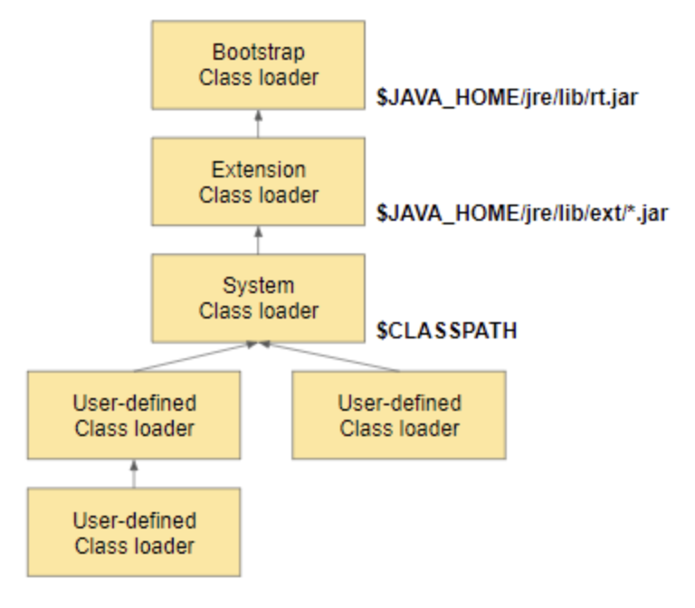
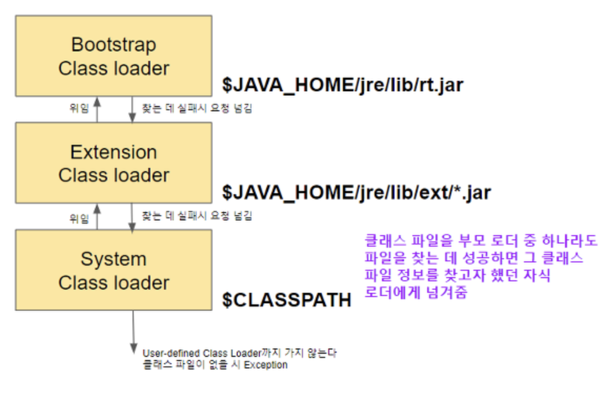

## 클래스 로더 (Class Loader)
JVM 내로 바이트 코드 (.class) 를 로드하고, 링크를 통해 배치하는 작업을 수행하는 모듈이며, Runtime시에 동적으로 클래스를 로드한다.

 

#### 세부 동작

> (1) 로드 : 클래스 파일을 바이트 코드로 읽어 JVM의 메모리에 로드한다.  
>
> (2) 검증 : 자바 언어 명세 (Java Language Specification) 및 JVM 명세에 명시된 대로 구성되어 있는지 검사한다.  
>
> (3) 준비 : 클래스가 필요로 하는 메모리를 할당한다. (필드, 메서드, 인터페이스 등등)  
>
> (4) 분석 : 클래스의 상수 풀 내 모든 심볼릭 레퍼런스를 다이렉트 레퍼런스로 변경한다.  
>
> (5) 초기화 : 클래스 변수들을 초기화한다. (static 필드)  

 
 

#### 특징
i) 계층적 구조 (Hierarchical)

여러 클래스 로더 끼리 부모-자식 관계의 계층적 구조를 가진다.

> a) 부트스트랩 클래스 로더 (Bootstrap Class Loader)
> 
> 최상위 클래스 로더로, 유일하게 Java가 아닌 네이티브 코드로 구현되어 있다.
> JVM이 실행될 때 같이 메모리에 올라가며, Object 클래스를 비롯하여 Java API를 로드한다. 
> ($JAVA_HOME/jre/lib/rt.jar에 있는 JVM을 실행시키기 위한 핵심 클래스들)

> b) 익스텐션 클래스 로더 (Extension Class Loader)
> 
> 기본 JAVA API를 제외한 확장 클래스들을 로드한다. 
> ($JAVA_HOME/jre/lib/ext 경로에 위치해 있는 자바의 확장 클래스들)

> c) 시스템 클래스 로더 (System Class Loader)
>
> 위 두 개의 클래스 로더가 JVM 자체 구성 요소들을 로드한다면, 시스템 클래스 로더는 어플리케이션의 클래스들을 로드한다.
> 사용자가 지정한 $CLASSPATH 내의 클래스들을 로드한다.

> d) 사용자 정의 클래스 로더 (User-Defined Class Loader)
>
> 어플리케이션 사용자가 직접 코드상에서 생성하여 사용하는 클래스들을 로드한다.

 

ii) 로딩 요청 위임 (Delegate Load Request)

클래스 로더가 클래스를 로딩할 때 그 로딩 요청은 부모 로더들로 거슬러 올라가서 부트스트랩 로더에 다다른 후 그 밑으로 로딩 요청을 수행하는 특성.

> ex) 시스템 로더가 A라는 클래스를 로드하는 경우
>
> System loader => (위임) Extension Class Loader => (위임) Bootstrap Loader 
>
> Bootstrap Loader에서 클래스를 못 찾았을 경우 => Extension Class Loader
>
> Extension Class Loader에서 클래스를 못 찾았을 시 => System Loader
>
> System Loader에서 클래스를 못 찾았을 시 => Exception

 

iii) 가시성 제약 조건 (Visibility Constraint)

부모 로더에서 찾지 못한 클래스는 자식 로더를 이용해서 클래스를 찾지 못하지만, 반대로 자식로더에서 찾지 못한 클래스는 부모 로더에게 위임해서 클래스를 찾을 수 있는 특성.

 

iv) 언로드 불가 (Can't Unload Classes)

클래스 로더에 의해 로딩된 클래스들은 다시 JVM상에서 없앨 수 (Unload) 없는 특성.

 

v) 네임 스페이스 (Name Space)

각 클래스 로더들이 가지고 있는 공간으로써, 로드된 클래스를 보관하는 공간.
 
> 클래스를 로드할 때 위임 모델을 통해서 상위 클래스 로더들을 확인하는데 그 때 확인하는 공간이 바로 네임 스페이스이며, 여기에 보관되는 기준은 FQCN을 기준으로 보관된다.
>
> FQCN (Fully Qualified Class Name) - 패키지명까지 포함되어 있는 식별자.
>
> 각 클래스 로더가 각자의 네임스페이스를 가지고 있기 때문에 FQCN이 같은 클래스라도 네임스페이스가 다르면 (다른 클래스 로더가 로드한 클래스) 다른 클래스로 간주한다.
>
> (이 특성을 이용하면 언로드를 대신해서 로드한 클래스 로더를 제거하면 마치 언로드한 것과 같은 효과를 줄 수 있다.)

 
 

#### Reference
https://engkimbs.tistory.com/606
https://steady-snail.tistory.com/67#recentEntries