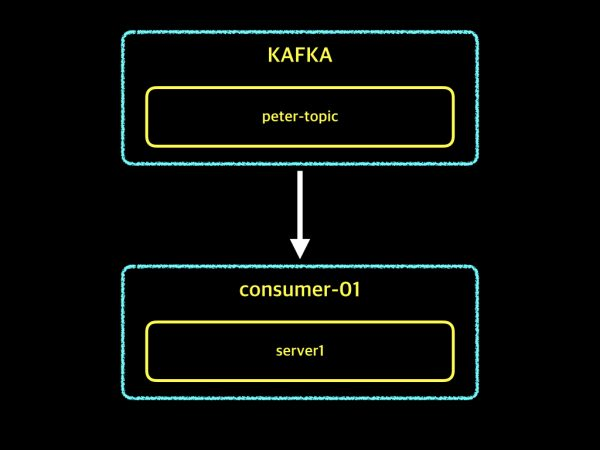
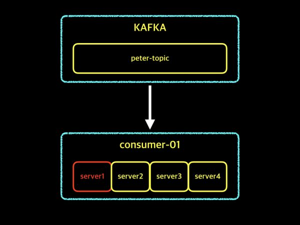
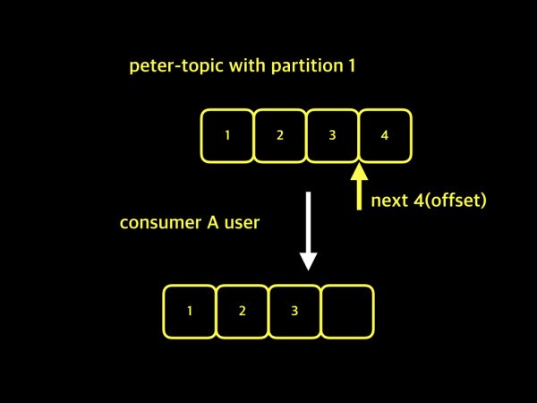

## 컨슈머 그룹 (Consumer Group) ID가 필요한 이유?

 

#### 1. 여러 개의 컨슈머를 그룹지어 장애가 발생하여도 작업을 계속 수행할 수 있어 안정성을 확보할 수 있다.

컨슈머 그룹에 서버가 한 대인 경우, 운영 중이던 컨슈머 서버에 장애가 발생하면 자신의 역할을 수행하지 못하고 데이터를 가져오는 작업도 중단된다.

 

하지만 컨슈머 그룹을 4대의 서버로 구성할 경우, 서버 한 대에 장애가 발생하여도 나머지 3대의 서버가 작업을 이어서 수행할 수 있기 때문에 작업 중단 없이 이어나갈 수 있다.

 
 

##### 2. 컨슈머 그룹들을 분리하고, 각 컨슈머 그룹들은 자신의 그룹에 대한 오프셋 (Offset) 을 관리할 수 있다.

peter-topic1에 [1, 2, 3, 4]라는 데이터가 있고, 사용자 A가 [1, 2, 3] 데이터를 가져갔다.
그런 후에, 다음에 가져갈 데이터는 4라는 자리 위치 (Offset) 를 기록한다.

카프카 컨슈머 그룹에 대한 구분이 없기 때문에, 어떤 사용자가 데이터를 가져가는지 알 수 없다.
따라서 사용자 B가 데이터를 가져갈 때, 사용자 A가 데이터를 가져가면서 저장된 오프셋 정보를 그대로 사용한다.

 

이러한 이유 때문에, 컨슈머 그룹마다 그룹네임을 지정하여 구분하고 각 컨슈머 그룹별로 자신의 오프셋을 관리함으로써 동일한 토픽에서 손실 없이 데이터를 가져갈 수 있다.