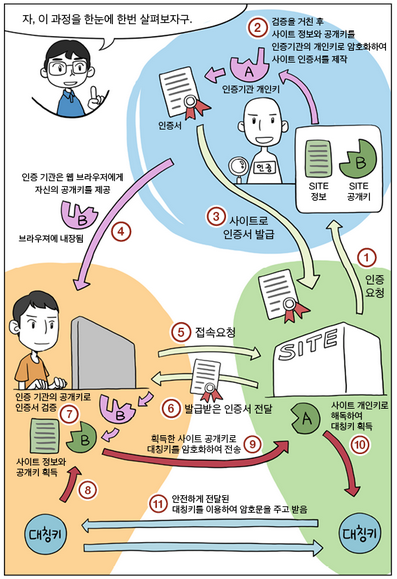

## HTTP & HTTPS

#### HTTP (HyperText Transfer Protocol)
웹 브라우저 (Client) 와 서버 (Server) 사이의 웹페이지 같은 자원을 주고 받는 통신규약 (Protocol).

 

#### HTTPS (HyperText Transfer Protocol Secure)
HTTP의 문제점
> 암호화 하지 않고 평문으로 통신을 하기 때문에 도청의 위험성이 있고,
통신 상대를 확인하지 않기 때문에 올바른 사용자인척 위장하여 통신을 할 수 있는 등 완전성을 증명할 수 없기 때문에 원본 데이터에 대한 변조의 가능성이 있다.

 

HTTPS는 증명서를 통해 서버 또는 클라이언트의 신원을 확인하고, 데이터를 암호화, 인증, 안정성 보호를 할 수 있는 프로토콜이다.  

HTTPS는 SSL 위에서 동작하는 HTTP 통신라고 생각하면 된다.

 

##### SSL (Secure Socket Layer) ?
인터넷 보안 프로토콜로, Certificate Authority (CA, 공인인증기관) 라 불리는 서드 파티로부터 서버와 클라이언트의 인증을 하는데 사용한다.

