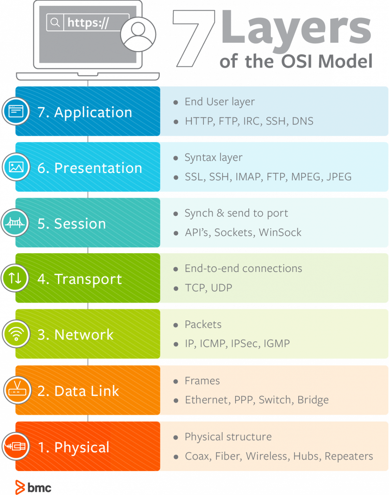

## OSI 7계층 (OSI 7Layer)
OSI (Open System Interconnection), 국제 표준화 기구 (ISO) 에서 발표한 시스템 간의 상호 연결성을 부여하는 표준 모델로, 네트워크 프로토콜 디자인과 통신을 계층으로 나눠 설명한 것이다.

 

 

계층을 나눈 이유?
> 흐름을 한 눈에 파악하기 쉽고, 7단계 중 특정한 곳에 이상이 생기면 다른 단계의 장비 및 소프트웨어를 건들지 않고도 이상이 생긴 단계만 고칠 수 있기 때문이다.

 

#### 물리 계층 (Physical Layer)
데이터를 전송하는 계층이며, 통신 단위는 비트이다.
데이터를 전송만 할 뿐 전송하려는 (또는 받으려는) 데이터가 무엇인지, 어떤 에러가 있는지 등에는 전혀 신경 쓰지 않는다. 
> 대표 장비
>
> 리피터, 케이블, 허브 등

 

#### 데이터 링크 계층 (Data Link Layer)
물리 계층으로 전달되는 정보를 관리하여 안전하게 전달되도록 도와주는 계층이며, 통신 단위는 프레임이다.
Mac 주소를 통해 통신하며, 프레임에 Mac 주소를 부여하고 에러검출, 재전송, 흐름제어를 진행한다.
> 대표 장비
>
> 브릿지, 스위치 등

 

#### 네트워크 계층 (Network Layer)
데이터를 목적지까지 가장 빠르고 안전하게 전달하는 기능 (라우팅) 을 수행하는 계층이며, 통신 단위는 패킷이다.
핵심 역할은 주소 (IP) 를 정하고, 경로 (Route) 를 선택하고, 패킷을 전달하는 것이다.
> 대표 장비
>
> 라우터, IP
 

#### 전송 계층 (Transport Layer)
TCP와 UDP 프로토콜을 통해 통신을 활성화하는 계층이며, 포트를 열어서 응용 프로그램들이 데이터를 전송할 수 있게 한다.
> 통신 단위
>
> TCP - 세그먼트  
> UDP - 데이터그램
>
> [UDP & TCP](UDP&TCP.md)

양끝단의 사용자들이 신뢰성 있는 데이터를 주고 받을 수 있도록 도와주고, 상위 계층들이 데이터 전달의 유효성이나 효율성을 생각하지 않도록 해준다. 

 

#### 세션 계층 (Session Layer)
데이터 통신을 위한 논리적인 연결을 수행하는 계층.  
이 계층은 TCP/IP 세션을 생성 및 제거, 통신하는 사용자들을 동기화하고 오류를 복구하는 역할을 수행한다.

> OS가 세션 계층에 속한다.

 

#### 표현 계층 (Presentation Layer)
응용 계층으로부터 전달받거나 전송하는 데이터의 인코딩 & 디코딩이 이루어지는 계층이다.
> MIME 인코딩이나 암호화 동작이 이루어진다.

응용 계층에서 데이터를 이해할 수 있게 응용프로그램에 맞춰 변환시켜준다.
> 다양한 포맷 : JPEG, TIFF, GIF, MPEG

 

#### 응용 계층 (Application Layer)
사용자 또는 어플리케이션이 네트워크에 접근할 수 있도록 도와주는 계층.
사용자에게 보이는 유일한 계층이며, 사용자를 위한 인터페이스를 제공한다. (이메일, DB 관리 등)
> HTTP, DNS, FTP 등
