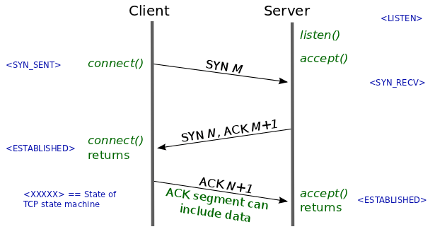
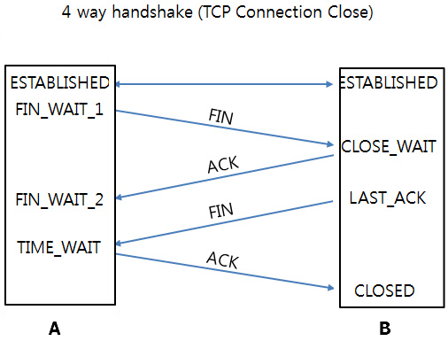

## TCP 3-Way Handshake &  4-Way Handshake

[TCP Flag 설명](TCPFlag.md)

 

#### 3-Way Handshake
TCP 통신을 이용하여 데이터를 전송하기 위해 네트워크 연결을 설정 (Connection Establish) 하는 과정.

1. 클라이언트 (Host A) 에서 서버 (Host B) 로 연결 요청 메시지 전송 (SYN) 한다.  
(이때, 클라이언트는 SYN을 전송하고 SYN / ACK 응답을 기다리는 SYN_SENT 상태가 된다.)

> 클라이언트가 최초로 데이터를 전송할 때, Sequence Number는 랜덤한 숫자로 지정한다.

> ISN (Initial Sequence Number) 을 랜덤한 숫자로 지정하는 이유?
>
> Connection을 맺을 때 사용하는 포트는 유한한 범위 내에서 반복적으로 재사용되므로 두 호스트가 과거에 사용했던 포트 번호 쌍을 사용하는 가능성이 존재한다.
> 서버 측에서는 SYN을 보고 패킷을 구분하는데, 난수가 아닌 Linear한 Number가 전송되면 이전의 Connection에서 오는 패킷으로 인식하는 문제가 발생할 수 있기 때문에 난수로 설정하는 것이다.

2. 서버는 SYN 요청을 수신하고 클라이언트에게 요청을 수락한다는 SYN (수신한 SYN + 1) 과 ACK Flag가 설정된 패킷을 전송하고 클라이언트로부터의 ACK를 기다린다.
(이때, 서버는 Listen 상태로 포트 서비스가 가능한 상태 (Closed : 닫힌 상태) 여야 하며, 전송 후엔 SYN_RECEIVED 상태가 된다.)

3. 클라이언트는 서버에게 ACK를 전송한 후, 연결이 이루어진 뒤 데이터가 오고 가게 된다.  (이때, 서버 상태는 ESTABLISHED가 된다.)

상태 종류
> CLOSED : 닫힌 상태
>
> LISTEN : 포트가 열린 상태로 연결 요청 대기 상태
>
> SYN_SENT : SYN 요청을 한 상태
>
> SYN_RECEIVED : SYN 요청을 받고 상대방의 응답을 기다리는 상태
>
> ESTABLISHED : 포트가 연결된 상태

 

> 단순한 응답을 주고 받는 것인데 왜 2-Way가 아니라 3-Way 일까?
>
> TCP/IP 통신은 양방향성 Connection이다. Host A가 Host B에게 존재를 알리고 패킷을 받을 수 있다는 것을 증명하듯이, Host B도 패킷을 보낼 수 있다는 신호를 보내야하는데, 이는 2-Way Handshake로는 성립될 수 없다.

 
 

#### 4-Way Handshake
TCP의 연결을 해제 (Connection Termination) 하는 과정.

1. 클라이언트 (Host A) 가 서버 (Host B) 에게 연결을 종료하겠다는 FIN 플래그를 전송한다.

2. 서버는 FIN을 수신한 후, ACK를 클라이언트에게 전송하고 자신의 통신이 끝날 때까지 기다린다.
(이때, 서버의 상태는 TIME_WAIT 상태가 된다.)

3. 서버는 통신이 모두 끝났으면 연결이 종료되었다고 클라이언트에게 FIN 플래그를 전송한다.

4. 클라이언트는 FIN 플래그를 받고 ACK를 서버에게 전송한다.

5. 서버는 ACK를 받고 소켓 연결을 종료한다.

6. 클라이언트는 아직 서버로부터 받지 못한 데이터가 있을 수도 있기 때문에 일정 시간 동안 세션을 남겨놓고 패킷을 기다리는 과정을 거친다. (TIME_WAIT)

TIME_WAIT?
> 서버에서 FIN을 전송하기 전에 전송한 패킷이 지연이나 패킷 유실로 인한 재전송 등으로 인해 FIN 패킷보다 늦게 도착하는 상황이 발생한다면 어떻게 될까?
>
> 클라이언트에서 세션을 종료시킨 후, 뒤늦게 도착하는 패킷이 있다면 이 패킷은 Drop되고 데이터는 유실될 것이다.
>
> TIME_WAIT은 이러한 현상에 대비하여, 클라이언트가 서버로부터 FIN을 수신하더라도 일정시간 동안 세션을 남겨놓고 잉여 패킷을 기다리는 것이다.

 
 

#### SYN Flooding
3-Way Handshake 과정 중 서버는 2단계에서 (클라이언트로부터 요청을 받고 응답을 한 뒤  다시 클라이언트의 응답을 기다리는 상태) 이 연결을 메모리 공간인 백로그 큐(Backlog  Queue) 에 저장 한다.

클라이언트의 응답, 즉 3단계를 기다리고 일정 시간 동안 응답이 오지 않으면 연결을 초기화한다.

SYN Flooding은 이 점을 이용하여 공격한다.

내용
> 실제로 존재하지 않는 클라이언트 IP로 응답이 없는 연결을 초기화 하기전에 계속해서 새로운 연결 (1단계 요청) 만 무수히 많이 보내어 백로그 큐를 포화상태로 만들어 다른 사용자로부터의 연결 요청을 더이상 못받게 하는 공격 방법이다.

대응책
> (1) 연결 타이머 시간을 짧게 한다.
> 
> (2) 백로그 큐의 사이즈를 늘린다.
>
> (3) 정해진 시간 동안 들어오는 연결 요청의 수를 제한한다.
>
> (4) 쿠키 (Cookie) 를 이용하여 전체 연결이 설정되기 전까지 자원 할당을 연기한다.