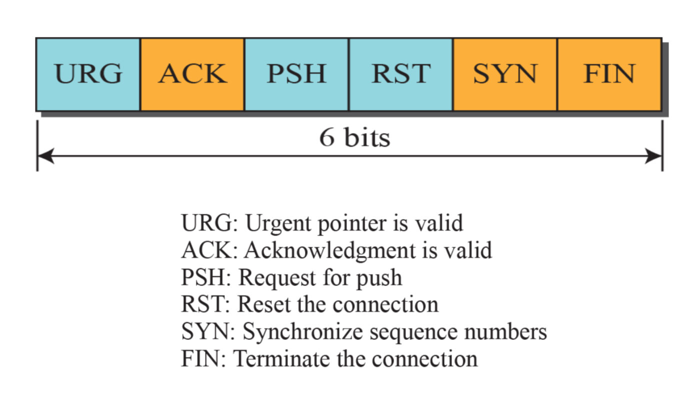

## TCP Flag

SYN : **SY**nchronize sequence **N**umber (연결 요청 플래그)
> TCP 에서 세션을 성립할 때, 가장 먼저 보내는 패킷이다.
> 시퀀스 번호를 임의적으로 설정하여 세션을 연결하는 데에 사용하고, 초기에 시퀀스 번호를 보내게 된다.

 

ACK : **ACK**nowledge (응답)
> 상대방으로부터 패킷을 받았다는 걸 알려주는 패킷이다.
> ACK 응답을 통해 보낸 패킷에 대한 성공, 실패를 판단하여 재전송 하거나 다음 패킷을 전송한다.

 

RST : **R**e**S**e**T** (제 연결 종료)
> 재설정 (Reset) 을 하는 과정이며, 양방향에서 동시에 일어나는 중단 작업이며, 비 정상적인 세션 연결 끊기에 해당한다.
> 이 패킷을 보내는 곳과 현재 접속하고 있는 곳의 연결을 즉시 끊고자 할 때 사용한다.

 

PSH : **P**u**SH** 밀어넣기
> TELNET 과 같은 상호작용이 중요한 프로토콜의 경우 빠른 응답이 중요한데, 이 때 받은 데이터를 즉시 목적지인 OSI 7 Layer 의 Application 계층으로 전송하도록 하는 Flag.
> 대화형 트래픽에 사용되는 것으로 버퍼가 채워지기를 기다리지 않고 바로 위 계층이 아닌 7 계층의 응용프로그램으로 전달한다.

 

URG : **URG**ent (긴급 데이터)
> Urgent Pointer가 유효한 것인지를 나타낸다.
> Urgent pointer? - 전송하는 데이터 중에서 긴급하게 전달해야 할 내용이 있을 경우 사용한다. 
> 긴급한 데이터는 다른 데이터에 비해 우선순위가 높아야 한다.
> ex) ping 명령어 실행 도중 Ctrl+c 입력

 

FIN : **FIN**ish (연결 종료 요청)
> 세션 연결을 종료시킬 때 사용되며 더이상 전송할 데이터가 없음을 나타낸다.