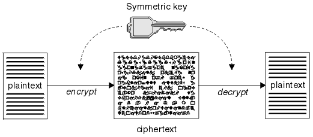
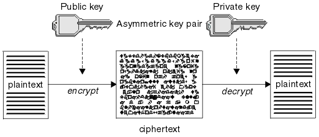

## 대칭키 & 공개키

#### 대칭키 (Symmetric-Key Cryptography)
암호화와 복호화에 동일한 암호키 (대칭키) 를 사용하는 방식

> 암호화 및 복호화가 빠르다. 

암호화 통신을 하는 사용자끼리 같은 대칭키를 공유해야만 한다는 단점이 있다.

> 즉, 암호를 주고 받는 사람들 사이에 대칭키를 전달하는 것이 어려우며, 대칭키가 유출되면 키를 획득한 공격자는 암호의 내용을 복호화 할 수 있기 때문에 암호가 무용지물이 되기 때문이다.

 
 

#### 공개키 (Public-Key Cryptography)
암호화와 복호화에 사용하는 암호키를 분리하여 사용하는 방식  
공개키 (Public Key) 로 정보를 암호화하고, 자신이 가지고 있는 비공개키 (비밀키 : Private Key) 로 복호화한다.

> 공개키가 유출된다고 해도 비공개키를 모르면 정보를 복호화할 수 없기 때문에 안전하다.
> 하지만, 키가 서로 다르기 때문에 암호화 & 복호화 연산 작업이 복잡하다.

시나리오
1. A가 웹 상에 공개된 'B의 공개키'를 이용하여 평문을 암호화하여 B에게 보낸다.

> 이 암호문 (CiperText) 은 B가 가지고 있는 B의 비밀키를 통해서만 복호화가 가능하다.

2. B는 자신의 비밀키로 복호화한 평문을 확인하고, A의 공개키로 응답을 암호화하여 A에게 보낸다.

3. A는 자신의 비밀키로 암호화된 응답문을 복호화한다.

 

##### 공개키 (Public Key) 로 암호화 한 경우
데이터 보안에 중점을 두는 것이다.

상대방의 공개키로 데이터를 암호화하고 전송하면, 데이터를 수신한 사람은 자신의 비밀키로 데이터를 복호화 한다.

> 공개키는 널리 배포될 수 있기 때문에 많은 사람들이 비밀키를 소유한 사람에게 데이터를 보낼 수 있다.

 

##### 비밀키 (Private Key) 로 암호화 한 경우
인증 과정에 중점을 두는 것이다.

공개키를 소유한 사람이 비밀키로 데이터를 암호화하고 공개키와 함께 전달한다.  
이 과정에서 공개키와 데이터를 획득한 사람은 공개키를 이용하여 복호화할 수 있다.

데이터가 노출되는 위험에도 불구하고 이 방법을 사용하는 이유?
> 데이터 보호 목적보다는 공개키 데이터 제공자의 신원을 보장해주기 때문이다.
>
> 암호화된 데이터가 공개키로 복호화 된다는 것은 공개키와 쌍을 이루는 비밀키에 의해서 암호화 되었다는 것을 의미하며 즉, 데이터 제공자의 신원 확인이 보장된다는 것이다.
>
> 이 방법이 공인인증체계의 바탕인 '전자 서명'.