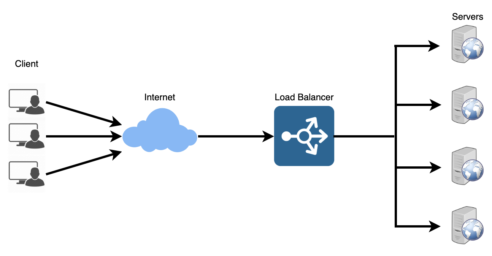
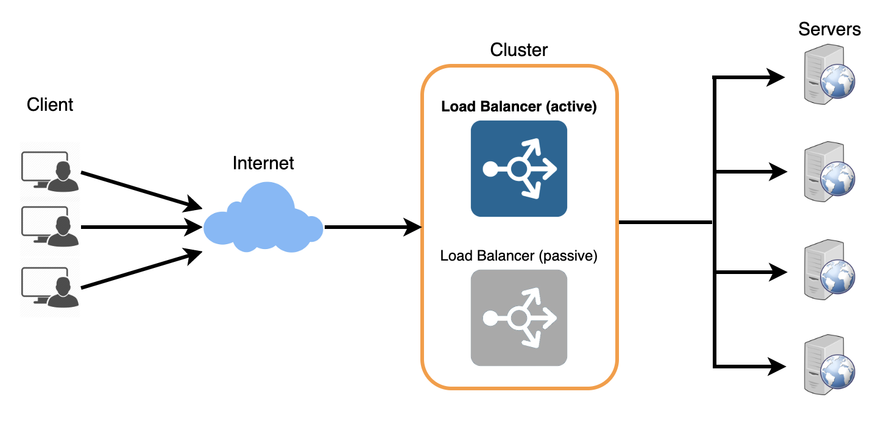

## 로드 밸런싱 (Load Balancing)
둘 이상의 CPU 또는 저장장치와 같은 컴퓨터 자원들에게 작업을 나누는 것

 

#### 등장 배경
시간이 지날수록 웹 사이트를 이용하는 인원이 급격하게 증가하면서 1대의 서버로 모든 트래픽을 감당할 수 없다.  

이에 대한 대응 방안으로 두 가지가 있다.
> (1) 하드웨어 성능을 올리는 방법 (Scale-Up)  
> (2) 여러 개의 서버가 일을 나눠 처리하는 방법 (Scale-Out)
>
> 하지만 하드웨어 업그레이드 비용이 비싸기도 하고, 여러 대의 서버를 가지고 있다면 무중단 서비스를 제공하는 환경구성이 용이하기 때문에 Scale-Out이 효과적이다.
>
> 즉, 로드 밸런싱이란 여러 서버에게 균등하게 트래픽을 분산시키는 것이다.

 
 

#### 서버를 선택하는 방식
1. 라운드 로빈 (Round Robin)

2. Least Connections : 연결 개수가 가장 적은 서버 선택 (트래픽으로 인해 세션이 길어지는 경우 권장한다.)

3. Source : 사용자 IP를 해싱하여 분배 (특정 사용자가 항상 동일한 서버에 연결되는 것을 보장한다.)

 
 

#### 장애 대응
로드 밸런서에 문제가 생길 경우을 대비해 이중화하여 대비한다.

과정
> (1) 이중화된 로드 밸런서들 (Active 및 Passive 상태의 로드 밸런서들) 은 서로 Health Check를 한다.  
> (2) 메인 로드 밸런서 (Active 상태의 로드 밸런서) 가 동작하지 않으면 가상 IP (Virtual IP) 는 여분의 로드 밸런서 (Passive 상태의 로드 밸런서) 로 변경 (Active 상태로 전환) 된다.  
> (3) 여분의 로드 밸런서 (Passive에서 Active로 전환된 로드 밸런서) 로 운영하게 된다.