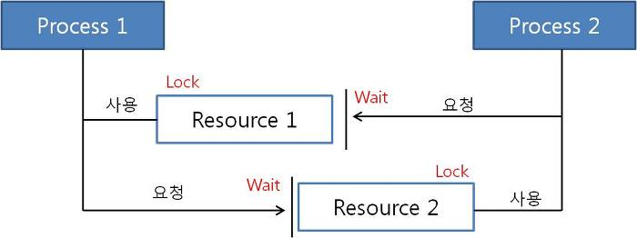
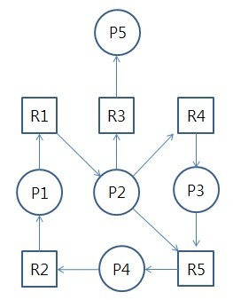

## 교착상태 (DeadLock)
프로세스가 자원을 얻지 못해서 다음 작업을 처리하지 못하는 상태이며, 한정된 자원을 여러 프로세스가 점유하려고 할 때 발생한다.

ex) 데드락 발생 예시

프로세스 1이 자원1을 점유하고 있는 상태에서 자원 2를 점유하기 위해 대기  

프로세스 2가 자원2을 점유하고 있는 상태에서 자원 1을 점유하기 위해 대기

각 프로세스가 원하는 자원이 상대 프로세스가 점유하고 있기 때문에 무한 점유 대기 상태에 빠진다.

 

## 교착상태 발생 조건
4가지 조건이 모두 만족해야 교착상태가 발생할 수 있다.

1. 상호 배제 (Mutual Exclusion)
각 자원은 한 번에 한 프로세스만 점유할 수 있다.
  
2. 점유 대기 (Hold and Wait)
하나의 자원을 점유하면서 다른 프로세스가 점유하고 있는 자원의 반납을 대기하는 프로세스가 존재해야 한다.
  
3. 비선점 (Non-Preemptive)
어떤 프로세스에 할당된 자원은 사용이 끝날 때까지 강제로 가져올 수 없다.
  
4. 순환 대기 (Circular Wait)
각 프로세스가 순환적으로 다음 프로세스가 요구하는 자원을 점유하고 있다.

 

## 교착상태 해결 방법
1. 예방 (Prevention)
교착상태 발생 조건 중 하나를 제거하여 교착상태가 발생하지 않도록 예방하는 방법이다.

- 상호 배제 부정 : 여러 프로세스가 하나의 자원을 모두 공유할 수 있도록 한다.
- 점유 대기 부정 : 프로세스가 실행 되기 전 모든 자원을 할당한다.
- 비선점 부정 : 프로세스가 자원을 점유하고 있는 동안 다른 프로세스가 자원을 요청하면 자원을 반납하고 대기한다.
- 순환 대기 부정 : 자원을 선형 순서로 분류하여 고유 번호를 할당하고, 각 프로세스는 현재 점유한 자원의 고유 번호보다 앞이나 뒤 어느 한쪽 방향으로만 자원을 요구한다.
  
   
  
2. 회피 (Avoidance)
교착상태가 발생할 가능성을 배제하지 않고 교착상태가 발생하면 적절히 피해나가는 방법이다.

- 은행원 알고리즘 (Banker's Algorithm) [[URL]](https://jhnyang.tistory.com/102)
은행에서 모든 고객의 요구가 충족되도록 현금을 할당하는 데에서 유래한 기법
(1) 프로세스가 자원 할당을 요청할 때, 자원을 할당한 후에도 시스템이 안정 상태 (Safe State) 로 남아있는 확인
(2) 안정 상태에 있다면 자원을 할당하고, 그렇지 않다면 다른 프로세스가 자원을 반납할 때까지 대기

3. 탐지 (Detection)
교착상태가 발생하였다면 발생 이후에 문제를 해결하는 방법이다.

- 자원 할당 그래프를 통해 교착상태를 탐지한다.
- 자원을 요청할 때마다 탐지 알고리즘이 실행되어 오버헤드가 발생한다.
  

프로세스 Pi, 자원 Ri
- Pi -> Ri : Pi가 Ri를 점유하기 위해 대기하고 있는 상태
- Ri -> Pi : Pi가 Ri를 점유하고 있는 상태

  
  
4. 회복 (Recovery)
교착상태를 일으킨 프로세스를 종료하거나 교착상태의 프로세스에 할당된 자원을 선점하여 회복하는 방법이다.

- 프로세스를 종료하는 방법
(1) 교착상태를 일으킨 프로세스를 모두 종료
(2) 교착상태가 회복될 때까지 프로세스를 하나씩 종료  
  

- 자원을 선점하는 방법
우선순위가 낮거나, 수행 횟수가 적은 프로세스를 위주로 해당 프로세스의 자원을 선점  
자원 선점시 고려사항
(1) 자원을 선점할 프로세스 선택 : 최소의 피해를 주는 프로세스를 선택
(2) 자원을 선점한 프로세스의 복귀 : 자원이 부족한 상태이므로 대부분 일시 중지하고 다시 시작하는 방법을 사용
(3) 기아 현상 : 한 프로세스가 계속해서 자원 선점 대상이 되지 않도록 고려