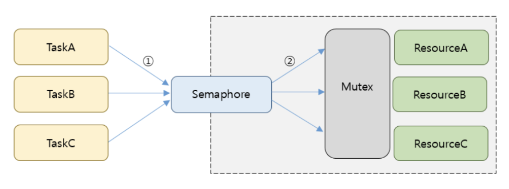
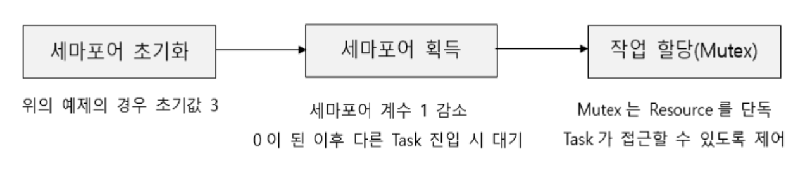

## 세마포어 & 뮤텍스
#### 세마포어 (Sempohre)

공유된 자원에 여러 프로세스가 동시에 접근하면 문제가 발생할 수 있다. 
이 때, 공유된 자원의 데이터는 한 번에 하나의 프로세스만 접근할 수 있도록 제한을 두기 위해 나온 것.

세마포어는 정수 값을 가지는 변수로 볼 수 있으며, 이 정수 값만큼 동시에 접근할 수 있게 허용한다.

요약 : 멀티프로그래밍 환경에서 공유 자원에 대한 접근을 제한하는 방법. 
(병행 처리를 위한 프로세스 동기화 방법)
> ex) 교차하는 철도에서 열차 진행가능 여부 / 세마포어는 깃발이란 뜻을 가지고 있다.


<br />

##### 세마포어 유형
> Binary Semaphore
>
> 목적 : 상호배제, 프로세스 동기화
> 내용 : 0 or 1

> Conut Semaphore
>
> 목적 : 초기에 동시에 진행 가능한 프로세스 개수를 정의할 수 있다.
> 내용 : 0, 1, 2, 3, ...

##### 세마포어 P, V 연산
- P : 임계 구역에 들어가기 전에 수행 (프로세스 진입 여부를 자원 개수 (S) 를 통해 결정)  
  
- V : 임계 구역에서 빠져나올 때 수행 (자원 반납 알림, 대기 중인 프로세스를 깨우는 신호)  

> 임계 구역 (Critical Section)
>
> 멀티 프로그래밍 환경에서 여러 프로세스가 데이터를 공유하며 수행될 때, 각 프로세스에서 공유 데이터를 액세스하는 프로그램 코드 부분.

구현 방법
```sql
P(S);

--- 임계 구역 ---
 
V(S)
```

```sql
procedure P(S)   --> 최초 S값은 1.
    while S=0 do wait  --> S가 0이면 1이 될때까지 기다려야 한다.
    S := S-1   --> S를 0으로 만들어 다른 프로세스가 들어 오지 못하도록 한다.
end P

--- 임계 구역 ---

procedure V(S) --> 현재상태는 S가 0이다.
    S := S+1   --> S를 1로 북구시켜 해제하는 과정이다.
end V
```

> ex) 최초에 S 값이 1이고, 현재 해당 구역을 수행할 프로세스 A, B가 있다.
>
> 1. 먼저 도착한 A가 P(S)를 실행하여 S를 0으로 만들고 임계구역에 진입한다.
>
> 2. 이후에 도착한 B가 P(S)를 실행하지만 S가 0이므로 대기 상태로 바뀐다.
>
> 3. A가 임계구역에서의 작업을 마치고 V(S)를 실행하면 S가 다시 1이 된다.
>
> 4. B가 P(S)의 while문을 빠져나올 수 있고, 임계구역으로 들어가 작업을 수행한다.


<br />
<br />

#### 뮤텍스 (Mutex)
공유된 자원의 데이터를 여러 쓰레드가 접근하는 것을 막는 것.

임계영역에 들어갈 때 락 (Lock) 을 걸어 다른 프로세스 (혹은 쓰레드) 가 접근하지 못하도록 하고, 임계영역에서 나와 해당 락을 해제 (Unlock) 한다.

즉, 뮤텍스 객체를 두 쓰레드가 동시에 사용할 수 없다.

> 뮤텍스는 0, 1 상태를 가지기 때문에 이진 세마포어 (Binary Semaphore) 라고도 한다. 
상호 배제(**Mut**ual **Ex**clusion)의 약자

```sql

mutex = 1;

void lock () {
	while (mutex != 1) {
    	/* mutex 값이 1이 될 때까지 대기한다. */
    }
    /* 
       임계 구역.
       뮤텍스 값을 0으로 만들어 다른 프로세스 (혹은 쓰레드) 가 접근하지 못하도록 해야 한다. 
    */
    mutex = 0;
}

void unlock() {
	/* 임계 구역에서 나온 프로세스는 다른 프로세스가 접근할 수 있도록 뮤텍스 값을 1로 변경한다. */
	mutex = 1;
}

```


<br />
<br />

#### 세마포어와 뮤텍스 비교
1. 세마포어는 공유 자원에 세마포어의 변수 (자원수) 만큼의 프로세스 (또는 쓰레드) 가 접근할 수 있다.
뮤텍스는 오직 프로세스 (또는 쓰레드) 1개만 접근할 수 있다.

2. 뮤텍스의 경우, 락 (Lock) 을 소유하고 있는 프로세스만이 이 락 (Lock) 을 해제할 수 있다.
세마포어의 경우, 세마포어를 소유하고 있지 않은 프로세스도 이 세마포어를 해제할 수 있다.

<br />

#### 세마포어를 이용한 자원 공유


> 리소스 공유 메커니즘
>
> N개의 태스크와 M개의 리소스 공유할 때, 세마포어 (Count Semaphore) 초기 값을 N개로 설정한다.

<br />


> 리소스 공유 절차
>
> 태스크가 세마포어를 획득해도 뮤텍스를 획득해야 리소스에 접근할 수 있다.