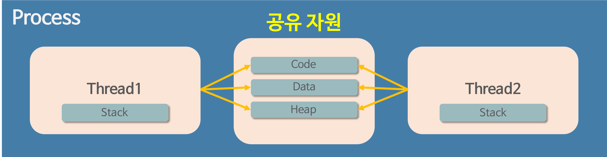

## 프로세스 & 쓰레드
#### 프로세스 (Process)
- 프로그램을 메모리 상에서 실행중인 작업
- 운영체제로부터 시스템 자원을 할당받는 작업의 단위

시스템 자원 ex) CPU 시간 / Code, Data, Stack,  Heap의 독립된 메모리 영역  

- Code : 코드 자체를 구성하는 메모리 영역 (프로그램 명령)
- Data : 전역 변수, 정적 변수, 배열 등의 영역 (초기화된 데이터)
- Heap : 동적 할당을 위한 메모리 영역 (new(), malloc())
- Stack : 지역 변수, 함수 파라미터, 리턴 값 등의 메모리 영역 (임시 데이터)

##### 특징
- 기본적으로 프로세스당 최소 1개의 스레드 (메인 스레드) 를 가지고 있다.
- 각 프로세스는 별도의 주소 공간에서 실행되며, 한 프로세스는 다른 프로세스의 변수나 자료구조에 접근할 수 없다.
- 한 프로세스가 다른 프로세스의 자원에 접근하려면 프로세스 간의 통신 (IPC, Inter-Process Communication) 을 사용해야 한다.

 

#### 쓰레드 (Thread)
- 프로세스 (Process) 안에서 실행되는 여러 흐름 단위
- 프로세스가 할당받은 자원을 이용하는 실행의 단위
  

##### 특징
- 각 쓰레드는 Stack과 PC Register를 할당 받고 나머지 (Code, Data, Heap) 영역은 서로 공유한다.
> Stack을 독립적으로 할당하는 이유  
Stack이 독립적이라는 것은 독립적인 함수 호출이 가능하다는 의미이며, 이는 독립적인 실행 흐름이 추가된다는 것이다. 따라서 쓰레드의 정의에 따라 독립적인 실행 흐름을 추가하기 위한 최소 조건으로 독립적인 스택을 할당한다.

> PC Register를 독립적으로 할당하는 이유  
PC 값은 쓰레드가 명령어의 어디까지 수행하였는지를 나타낸다. 쓰레드는 CPU를 할당받았다가 스케줄러에 의해 다시 선점당하기 때문에 명령어가 연속적으로 수행되지 못하고 어느 부분까지 수행했는지 기억할 필요가 있다. 따라서 PC 레지스터를 독립적으로 할당한다.
  
 
 
  
## 멀티 프로세스 & 멀티 쓰레드
#### 멀티 프로세스
하나의 프로그램을 여러 개의 프로세스로 구성하여 각 프로세스가 하나의 태스크를 처리하도록 하는 것이다.

장점
- 하나의 프로세스에 문제가 생겨도 다른 프로세스에 영향을 미치지 않는다.
  
단점
- 각 프로세스가 독립적인 메모리 영역을 가지고 있기 때문에 문맥 교환 (Context Switching) 에 대해 오버헤드가 발생할 수 있다.

 

#### 멀티 쓰레드
하나의 프로그램을 여러 개의 쓰레드로 구성하여 각 쓰레드가 하나의 태스크를 처리하도록 하는 것이다.

장점
- 프로세스를 생성하여 자원을 할당하는 시스템 콜 (System Call) 이 줄어들어 효율적으로 자원을 관리할 수 있다.
- 쓰레드의 Context Switching은 캐시 메모리를 비울 필요가 없기 때문에 자원 소모가 줄어들게 된다.
- 프로세스 내에서 Stack을 제외한 모든 메모리를 공유하기 때문에 통신 부담이 적다.
  
단점
- 하나의 쓰레드에 문제가 생기면 프로세스 전체가 영향을 받는다.
- 다른 프로세스에서 쓰레드를 제어할 수 없다.

