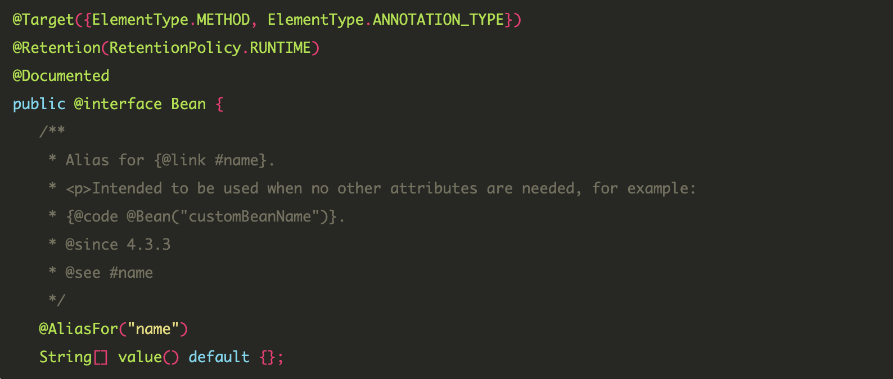

## @Bean & @Component

#### @Bean
개발자가 컨트롤이 불가능한 외부 라이브러리들을 빈으로 등록하고 싶을 때 사용한다.

Setter나 Builder를 통해 사용자가 프로퍼티를 변경해서 생성한 인스턴스를 Spring에게 관리하라고 맡기는 것이다.

> ex) ObjectMapper의 경우 ObjectMapper Class에 @Component를 선언할 수 없다.  
> 따라서 ObjectMapper의 인스턴스를 생성하는 메소드를 만들고 **해당 메소드에 @Bean을 선언**하여 Bean으로 등록한다.

 

#### @Component
개발자가 컨트롤이 가능한 (직접 작성한) Class들의 경우에 사용한다.

클래스를 Spring에게 알아서 인스턴스 생성 및 Bean 등록 과정을 모두 맡기는 것이다.

 
 

둘은 각자 선언할 수 있는 타입이 정해져 있기 때문에 해당 용도외의 선언은 컴파일 에러를 발생시킨다.

Bean

 

Component
