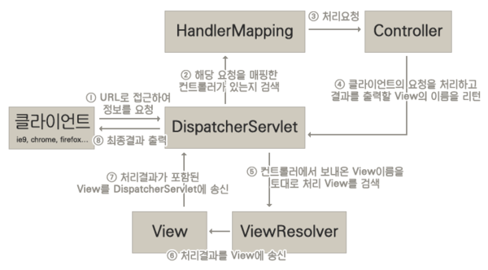

## DispatcherServlet
Servlet Container에서 HTTP 프로토콜을 통해 들어오는 모든 요청을  
프레젠테이션 계층의 제일 앞에 둬서 중앙집중식으로 처리해주는 프론트 컨트롤러

> 클라이언트로부터 어떤 요청이 들어오면 Tomcat (톰캣) 과 같은 Servlet Container가 요청을 받는데,  
> 이때 서버에 들어오는 모든 요청을 제일 앞에서 처리하는 프론트 컨트롤러를 Spring에서 정의하였고, 이를 DispatcherServlet이라고 한다.
>
> 그래서 공통처리를 DispatcherServlet이 처리한 후, 적절한 세부 컨트롤러로 작업을 위임한다.

 
 

#### 장점
기존에는 요청 URL당 Servlet을 생성하고 그에 맞는 Controller에게 요청을 보내주는 코드를 전부 각각 따로 web.xml에 작성해야 했다.

하지만, DispatcherServlet이 해당 어플리케이션으로 들어오는 모든 요청을 핸들링해주면서 작업을 상당히 편리하게 할 수 있고, 이 서블릿을 이용한다면 @MVC 역시 사용할 수 있게 됐다.

 
 

#### 단점
요청을 Controller에게 넘겨주는 방식은 효율적인 것처럼 보이지만, 모든 요청을 처리하다보니 이미지나 HTML 파일을 불러오는 요청마저 전부 Controller에게 넘긴다.

게다가,JSP 파일 안의 JavaScript나 StyleCSS 파일들에 대한 요청들 까지도 모두 DispatcherServlet이 가로채기 때문에 자원을 불러오지 못하는 상황도 발생한다.  

 
 

#### 해결책
1. 클라이언트의 요청을 2가지로 분리하여 구분
(1) /apps의 URL로 접근하면 DispatcherServlet이 담당한다.
(2) /resources의 URL로 접근하면 DispatcherServlet이 컨트롤할 수 없으므로 담당하지 않는다.

이러한 방식은 괜찮지만 상당히 코드가 지저분해지며, 모든 요청에 대해서 위와 같은 URL을 붙여주기 때문에 직관적인 설계가 될 수 없다.

 

2. 모든 요청을 컨트롤러에 등록

이 방법은 상당히 무식한 방법이다.

 
 

###### <mvc:resources />
Spring에서 이러한 문제들을 해결함과 동시에 편리한 방법을 제공해주는 것

만약 DispatcherServlet에서 해당 요청에 대한 컨트롤러를 찾을 수 없는 경우, 2차적으로 설정된 경로에서 요청을 탐색하여 자원을 찾아내는 것이다.  

이렇게 영역을 분리하면 효율적인 리소스관리를 지원할 뿐 아니라 추후에 확장을 용이하게 해준다는 장점이 있다.