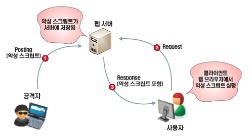
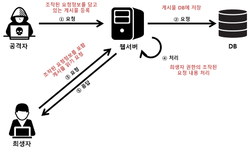

## XSS & CSRF

#### XSS (Cross-Site Scripting)
악의적인 사용자가 서버에 스크립트를 집어넣어 클라이언트를 공격하는 방법이다.

> 주로 다른 웹 사이트와 정보를 교환하는 식으로 작동하며, 희생자는 사용자다.

 

> 원인 : 웹 애플리케이션이 사용자로부터 입력받은 값을 제대로 검사하지 않고 사용할 경우 발생한다.
>
> 결과 : 사용자는 의도치 않은 행동을 수행하거나, 쿠키 또는 세션 정보를 탈취당한다.
>
> 클라이언트 (사용자) 가 서버를 신뢰하는 취약점을 이용한 것이다.

##### 대응 방안
(1) 쿠키에 중요한 정보를 담지 않고 서버에 저장한다.

(2) 정보를 암호화한다.

(3) document.cookie를 이용하여 쿠키에 접속하는 것을 방지한다.

(4) url encoding이나 문자열을 치환한다.

 
 

#### CSRF (Cross Site Request Forgery)
클라이언트가 자신의 의지와는 상관없이 공격자가 의도한 요청하여 공격하는 방법이다.

사용자가 웹사이트에 로그인한 상태에서 CSRF코드가 삽입된 페이지를 열면,  
공격 대상이 되는 웹사이트는 위조된 공격이 신뢰할 수 있는 클라이언트 (사용자) 에게서 요청된 것으로 판단하여 공격에 노출된다.

> 서버가 인증된 클라이언트 (사용자) 를 신뢰하는 취약점을 이용한 것이다.

 

> 공격이 이뤄지기 위한 조건
>
> (1) 위조 요청을 전송하는 서비스에 희생자가 로그인 상태  
> (2) 희생자가 해커가 만든 피싱 사이트에 접속

 

##### 대응 방안
(1) Referrer 검증

> 서버단에서 요청의 referrer를 확인하여 도메인이 일치하는지 검증한다.

 

(2) Security Token을 사용 

> 사용자 세션에 암호화된 값을 저장하고, 사용자의 요청마다 암호화된 값을 포함시켜 전송한다.  
> 이후 서버에서 요청을 받을 때마다 세션에 저장된 토큰 값과 요청에 전달된 토큰 값이 일치하는지 확인한다.