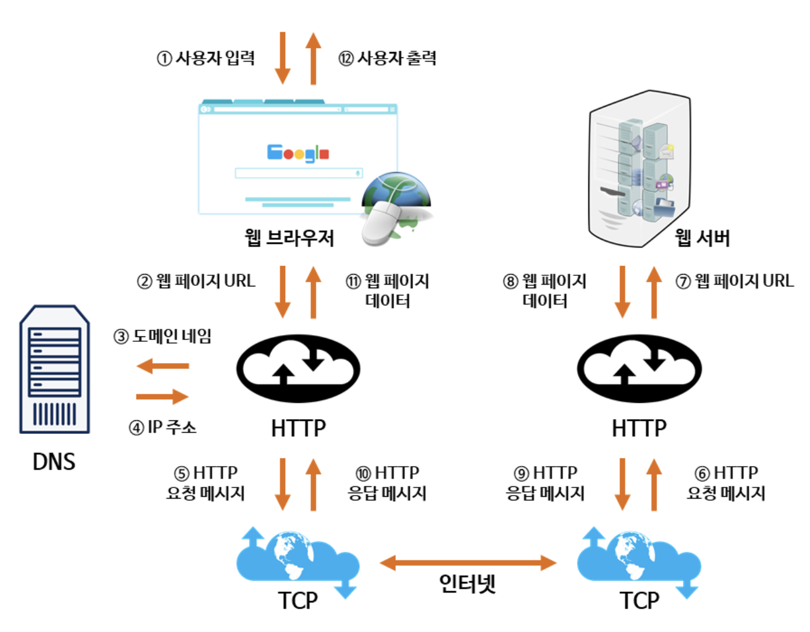

## 웹 동작원리

 

① ~ ② : 사용자가 원하는 웹 페이지의 URL 주소를 입력한다.

 

③ : 사용자가 입력한 URL 주소 중에서 도메인 네임 (Domain Name) 부분을 DNS 서버에서 검색한다.
> 도메인 네임
>
> IP 주소를 사람이 기억하기 쉬운 문자 형태로 표현한 주소 ('naver.com'처럼 몇 개의 의미있는 문자들과 점(.)의 조합으로 구성)

 

④ : DNS 서버에서 해당 도메인 네임에 해당하는 IP 주소를 찾아 사용자가 입력한 URL 정보와 함께 전달한다.

 

⑤ ~ ⑥ : 웹 페이지 URL 정보와 전달받은 IP 주소는 HTTP 프로토콜을 사용하여 HTTP 요청 메시지를 생성한다.  
이렇게 생성된 HTTP 요청 메시지는 TCP 프로토콜을 사용하여 인터넷을 거쳐 해당 IP 주소의 컴퓨터로 전송된다.

 

⑦ : 이렇게 도착한 HTTP 요청 메시지는 HTTP 프로토콜을 사용하여 웹 페이지 URL 정보로 변환된다.

 

⑧ : 웹 서버는 도착한 웹 페이지 URL 정보에 해당하는 데이터를 검색한다.

 

⑨ ~ ⑩ : 검색된 웹 페이지 데이터는 또 다시 HTTP 프로토콜을 사용하여 HTTP 응답 메시지를 생성한다.  
이렇게 생성된 HTTP 응답 메시지는 TCP 프로토콜을 사용하여 인터넷을 거쳐 원래 컴퓨터로 전송된다.

 

⑪ : 도착한 HTTP 응답 메시지는 HTTP 프로토콜을 사용하여 웹 페이지 데이터로 변환된다.

 

⑫ : 변환된 웹 페이지 데이터는 웹 브라우저에 의해 출력되어 사용자가 볼 수 있게 된다.

 
 

#### Reference
http://tcpschool.com/webbasic/works